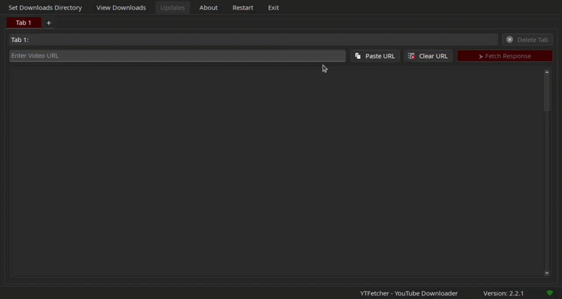

# YTFetcher - YouTube Downloader

A high-performance, modern desktop application designed for seamless YouTube content retrieval. Built with **Python** and **PyQt6**, **YTFetcher** offers a sophisticated user interface featuring glassmorphism elements and a robust multi-threaded architecture for efficient video and transcript processing.

## Features

  * **Multi-Tab Interface:** Manage multiple downloads and searches simultaneously with an intuitive tabbed system.
  * **High-Quality Downloads:** Support for various video resolutions and audio formats.
  * **Transcript & Subtitles:** Integrated tools to fetch and translate YouTube transcripts using advanced translation APIs.
  * **Modern UI/UX:** Dark-themed, responsive design built with custom PyQt6 widgets and smooth animations.
  * **Resource Management:** Efficient processing to ensure minimal system impact during heavy tasks.

## Demo



## Technical Stack

  * **GUI Framework:** [PyQt6](https://www.riverbankcomputing.com/software/pyqt/)
  * **Processing:** [Pytubefix](https://github.com/JuanBindez/pytubefix), [OpenCV](https://opencv.org/)
  * **Data Handling:** NumPy, JSON
  * **Translation:** Googletrans API
  * **Packaging:** PyInstaller

## Installation

1.  **Clone the repository:**

    ```bash
    git clone https://github.com/asem-sharif-ai/YTFetcher.git
    cd YTFetcher
    ```

2.  **Install dependencies:**

    ```bash
    pip install -r requirements.txt
    ```

3.  **Run the application:**

    ```bash
    python App.py
    ```

## Project Structure

  * `App.py`: The entry point for the application.
  * `Main.py`: Core application logic and main window management.
  * `SRC/Service.py`: Backend services for YouTube interaction and data processing.
  * `SRC/Style.py`: Custom QSS styling and UI component definitions.
  * `SRC/Tabs.py`: Logic for the multi-tab navigation system.

## 🔧 Build

To create a standalone executable for Windows, use the following command:

```bash
pyinstaller --onedir --windowed --icon=Icon.ico --add-data "Icon.ico;." App.py
```
