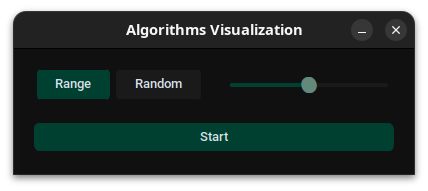
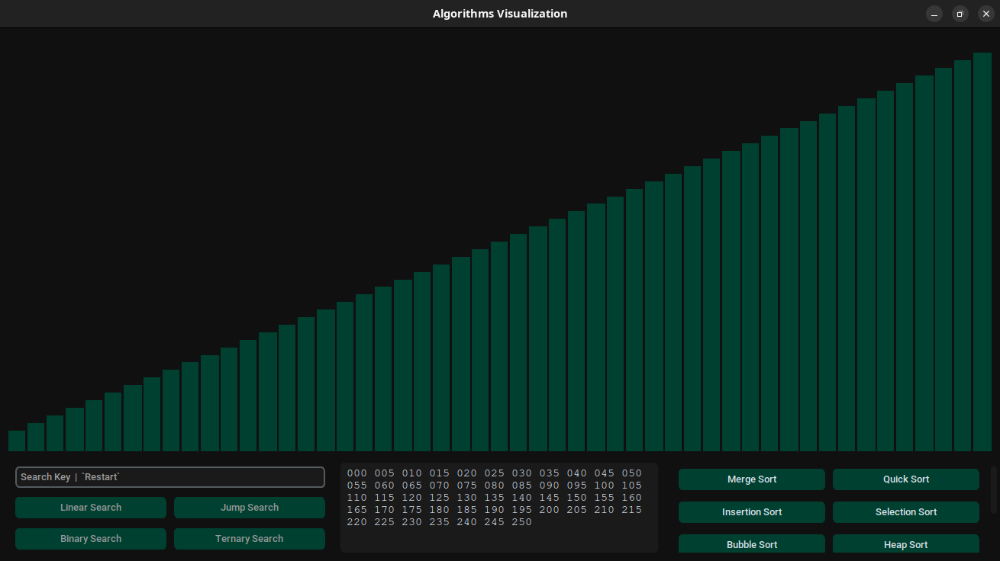
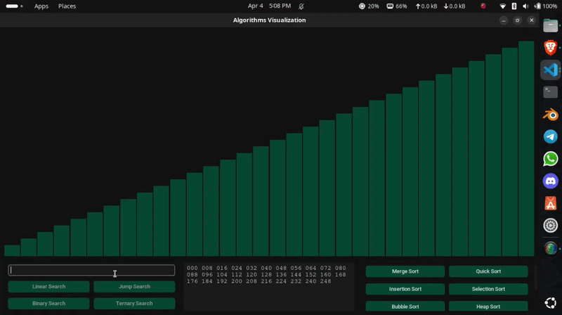
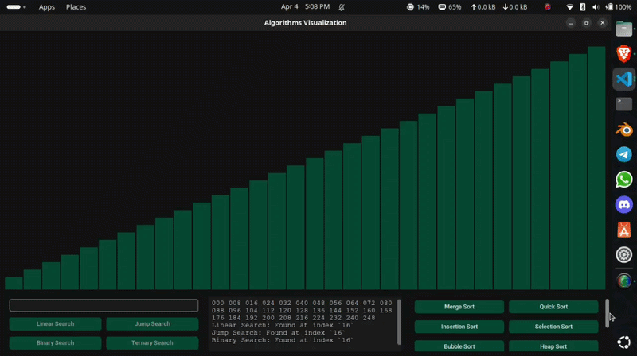

# Algorithms Visualizer

> An interactive desktop application for visualizing classic sorting and searching algorithms in real time - built with Python and customtkinter.

---

## UI Screenshots

| Setup Screen | Main Screen |
|-------------|------------|
|  |  |

---

## Searching Preview



---

## Sorting Preview



---

## Overview

Algorithms Visualizer is a desktop GUI that brings sorting and searching algorithms to life through animated bar charts. Each bar represents a data element, and color changes show exactly what each algorithm is doing at every step - comparisons, swaps, pivots, and found elements are all visible in real time.

Built as part of a Data Structures & Algorithms course at the Faculty of Artificial Intelligence, Menoufia University.

---

## Algorithms

### Sorting

| Algorithm | Best | Average | Worst | Space |
|-----------|------|---------|-------|-------|
| Bubble Sort | O(n) | O(n²) | O(n²) | O(1) |
| Selection Sort | O(n²) | O(n²) | O(n²) | O(1) |
| Insertion Sort | O(n) | O(n²) | O(n²) | O(1) |
| Merge Sort | O(n log n) | O(n log n) | O(n log n) | O(n) |
| Quick Sort | O(n log n) | O(n log n) | O(n²) | O(log n) |
| Heap Sort | O(n log n) | O(n log n) | O(n log n) | O(1) |

### Searching

| Algorithm | Best | Average | Worst | Requirement |
|-----------|------|---------|-------|-------------|
| Linear Search | O(1) | O(n) | O(n) | None |
| Jump Search | O(1) | O(√n) | O(√n) | Sorted |
| Binary Search | O(1) | O(log n) | O(log n) | Sorted |
| Ternary Search | O(1) | O(log₃n) | O(log₃n) | Sorted |

---

## Features

- **Real-time animation** - watch every comparison, swap, and pivot as it happens
- **Two data modes** - sequential (Range) or randomly shuffled values
- **Adjustable dataset size** - slider from 10 to 90 elements
- **Clickable bars** - click any bar to auto-fill it as the search key
- **Live terminal log** - prints search results and found index after each run
- **Shuffle / Sort / Reverse** - reset and rearrange data without restarting
- **Restart anytime** - type `Restart` in the search field to go back to the start screen

---

## Color Guide

| Color | Meaning |
|-------|---------|
| 🟩 Dark green | Default / idle element |
| 🟨 Gold | Found / placed in correct position |
| 🟫 Teal | Active - currently being compared or swapped |
| ⬜ White | Target search key |

---

## Installation

**Requirements**
- Python 3.8+
- numpy
- customtkinter
```bash
pip install numpy customtkinter
```

---

## Run
```bash
python Algorithms.py
```

---

## How to Use

1. Launch the app - a small setup window appears
2. Choose data type: **Range** (sequential) or **Random**
3. Drag the slider to set the dataset size, then click **Start**
4. The main window opens with an animated bar chart
5. Click any **sorting button** to watch it animate live
6. Type a number in the search field to enable search buttons
7. Click any **bar** to auto-fill its value as the search target
8. Use **Shuffle**, **Sort**, or **Reverse** to rearrange data
9. Type `Restart` in the search field to return to the setup screen

---

## Project Structure
```
[CTk] Algorithms Visualizer/
├── Algorithms.py      # Entry point and full application
├── README.md          # Project documentation
├── Search.gif         # Searching algorithms demo
├── Sort.gif           # Sorting algorithms demo
├── UI-1.png           # Setup screen screenshot
└── UI-2.png           # Main screen screenshot
```

---

## Course

**Data Structures & Algorithms**
Faculty of Artificial Intelligence, Menoufia University