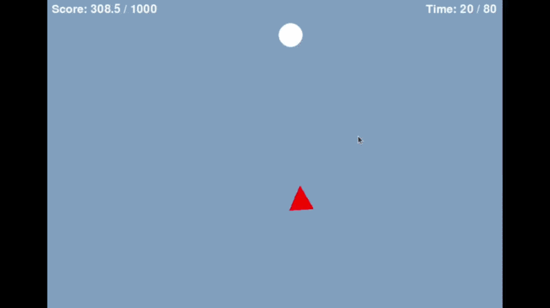

# Escape To Survive

> A 2D pursuit-evasion game built with Pygame — where an AI-controlled attacker hunts the player using real-time vector mathematics and trigonometric rotation.

---

## Demo



---

## Overview

Escape To Survive is a single-player survival game where the goal is simple — don't get caught. An AI attacker chases the player across the screen, always recalculating its direction every frame using vector normalization. The player must survive a countdown timer while managing a score that grows under pressure.

Built in year 1 as an early exploration of game loops, real-time physics, and 2D math in Python.

---

## Math & Mechanics

### Vector Pursuit (Attacker AI)

Every frame, the attacker calculates the direction toward the player using a displacement vector:
```
vector = (defender.x - attacker.x, defender.y - attacker.y)
```

This vector is then **normalized** to unit length so speed stays constant regardless of distance:
```
magnitude = √(vx² + vy²)
unit_vector = (vx / magnitude, vy / magnitude)
```

The attacker then moves by multiplying the unit vector by its speed — making it always chase at a fixed rate.

### Trigonometric Rotation

The attacker (a triangle) always **points toward the player**. The angle is computed using `atan2`, which returns the angle in radians between the vector and the x-axis:
```
angle = atan2(vy, vx)  →  converted to degrees  →  rotated with pygame.transform.rotate()
```

This gives the attacker a realistic aiming effect without any sprite sheets or animations.

### Screen Wrapping (Looping Mode)

In Loop mode, the player wraps around screen edges using boundary checks — exiting the right side reappears on the left, and so on. Disabled in Extreme Impossible mode to trap the player.

### Diagonal Movement

Arrow key combinations are detected simultaneously to allow true 8-directional movement, giving the player full control at equal speed in all directions.

---

## Game Modes

| Mode | Attacker Speed | Score Rate | Loop | Time |
|------|---------------|------------|------|------|
| Normal | 2 | +0.10 / frame | ✅ | 80s |
| Hard | 2.5 | +0.15 / frame | ✅ | 80s |
| Impossible | 5 | +0.20 / frame | ✅ | 80s |
| Extreme Impossible | 5 | +0.25 / frame | ❌ | 60s |

---

## Win & Lose Conditions

| Outcome | Condition |
|---------|-----------|
| Defender Wins | Survive until the timer runs out |
| Attacker Wins | Score reaches the win threshold while being caught |
| Defender Loses | Score reaches the win threshold while holding SPACE |

---

## Controls

| Key | Action |
|-----|--------|
| Arrow Keys | Move the defender |
| SPACE | Defending mode (hold to block) |
| TAB | Reset the game |
| ESC | Quit |

---

## Installation
```bash
pip install pygame
```

## Run
```bash
python Escape.py
```

---

## Configuration

All settings are at the top of the file and can be modified directly:
```python
Game_Mode  = 'Normal'   # 'Normal', 'Hard', 'Impossible', 'Extreme Impossible'
Game_Speed = 'Normal'   # 'Slow', 'Normal', 'Fast'
Loop       = True       # Screen wrapping on/off
secTime    = 80         # Countdown duration in seconds
winScore   = 1000       # Score threshold to end the game
```

---

## Project Structure
```
Escape To Survive/
├── Escape.py     # Full game source
├── README.md     # Project documentation
└── demo.gif      # Gameplay demo
```

---

## Course

**Introduction to Programming**
Faculty of Artificial Intelligence, Menoufia University — Year 1