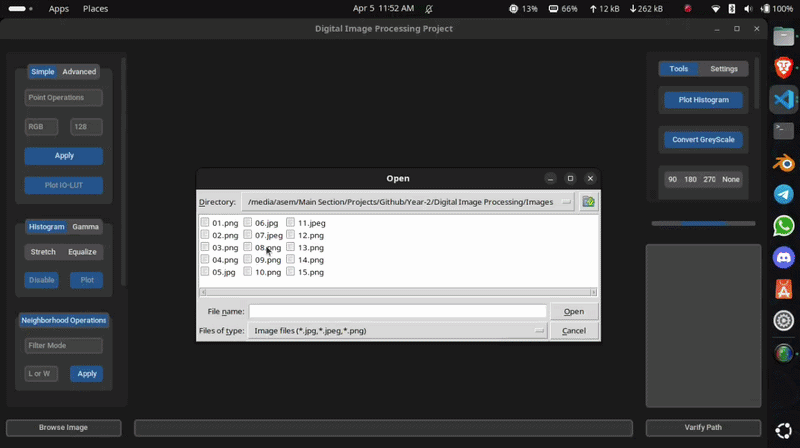
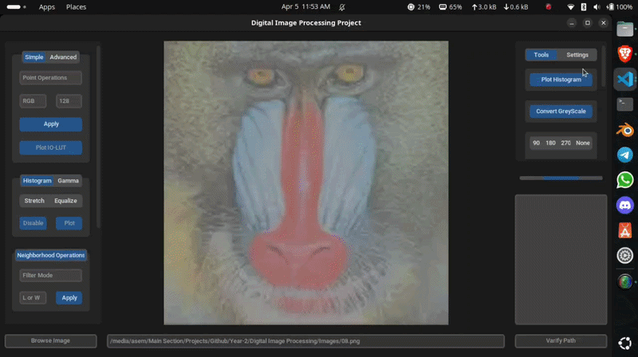
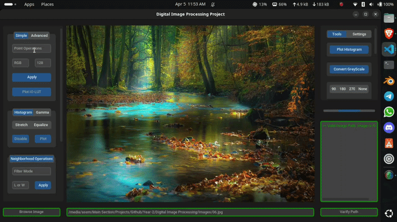
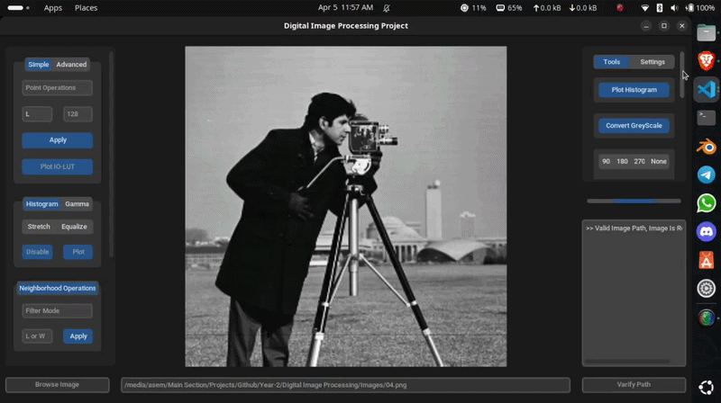
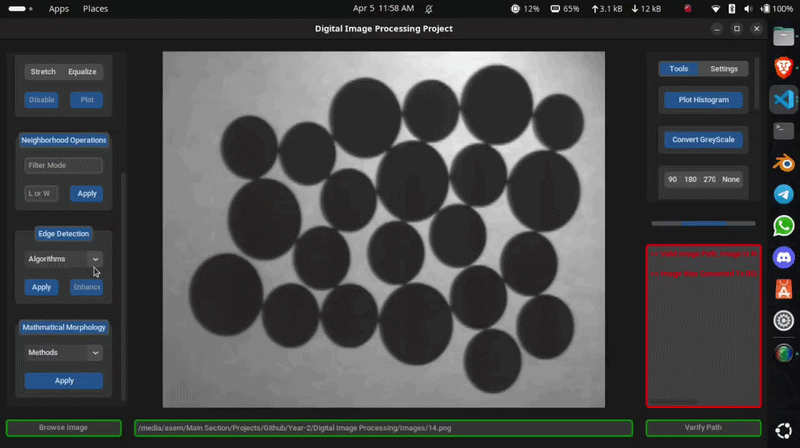

# Digital Image Processing - Desktop Application

> A full-featured desktop application for classical image processing - built from scratch using NumPy and PIL, wrapped in a customtkinter GUI. Every core algorithm is a direct implementation of the mathematical definitions covered in the Digital Image Processing course.

---

## Demo

| Import & Histogram operations | Toolbox |
|---|---|
|  |  |

| Histogram plot | Histogram matching |
|---|---|
|  |  |

| Neighborhood & spatial filtering | Edge detection |
|---|---|
|  |  |

---

## Overview

This project was built as the practical component of the Digital Image Processing course at the Faculty of Artificial Intelligence, Menoufia University. The goal was to implement every algorithm from the ground up - not to call `cv2.Canny()` or `cv2.equalizeHist()`, but to understand and reproduce the math behind them.

The application loads images, applies a chain of processing operations in real time, and displays results on a live canvas. All spatial operations follow the same pipeline:
```
Load → Convert to NumPy array → Pad → Slide window → Compute → Clip → Reconstruct PIL image
```

High-level library functions (`threshold_otsu`, `match_histograms`, `binary_dilation`) were used only where the operation itself was not the subject of study.

---

## Implemented Operations

---

### Point Operations - `PointOperations.py`

Pixel-wise transforms applied via a precomputed **Look-Up Table (LUT)**. The LUT maps every possible input intensity (0–255) to an output value, then `Image.eval()` applies it in a single pass - avoiding per-pixel Python loops entirely.

| Operation | Transform |
|-----------|-----------|
| Add | `p + factor` |
| Subtract | `p - factor` |
| Multiply | `p × factor` |
| Divide | `p // factor` |
| Complement | `255 - p` |
| Solarize Dark | `p if p ≥ T else 255 - p` |
| Solarize Light | `p if p ≤ T else 255 - p` |
| Custom Expression | `e(aX±b)` evaluated per pixel |

Supports per-channel operation on R, G, B independently, channel elimination, and channel swapping.

**Image Arithmetic** - operations between two loaded images using NumPy array math:

| Operation | Method |
|-----------|--------|
| Add | `np.add(A, B)` |
| Subtract | `np.subtract(A, B)` |
| Multiply | `np.multiply(A, B)` |
| Divide | `np.divide(A, max(B, 1))` |
| Average | `(A + B) // 2` |
| Min / Max | `np.minimum / np.maximum` |
| Histogram Match | `skimage.exposure.match_histograms` |

---

### Gamma Correction - `GammaCorrection.py`

Applies the standard **power-law (gamma) transform** via LUT:
```
output = 255 × (input / 255) ^ γ
```

`γ < 1` brightens the image by expanding low intensities, `γ > 1` darkens it by compressing them. The LUT is plotted as an IO curve showing the nonlinear mapping across the full 0–255 range.

---

### Histogram Operations - `HistogramOperations.py`

Both operations are self-implemented from their statistical definitions.

**Histogram Stretching** - linearly rescales intensities to fill the full [0, 255] range:
```
output = 255 × (p - Min) / (Max - Min)
```

**Histogram Equalization** - redistributes intensities to flatten the histogram using the cumulative distribution function:
```
PDF[i] = Histogram[i] / N          (probability of each intensity)
CDF[i] = Σ PDF[0..i]               (cumulative sum)
LUT[i] = round(CDF[i] × 255)       (new intensity mapping)
```

Both operations work on grayscale and RGB. For RGB, each channel is processed independently then merged back via `Image.merge()`. Plots show before/after histograms, PDF, CDF, and the LUT curve side by side.

**Contrast Detection** - classifies image contrast from the histogram using 10th and 90th percentile thresholds:
```
Low Contrast  : P90 - P10 < 100
High Contrast : P90 - P10 > 200
Normal        : otherwise
```

---

### Neighborhood Operations - `NeighborhoodOperations.py`

A general-purpose spatial filter engine. For every pixel, a kernel-sized neighborhood is extracted from the padded image and reduced by a kernel function. Two modes are supported:

**Size-based** - kernel size is given as an integer, the reduction function is applied to the raw neighborhood:

| Mode | Reduction |
|------|-----------|
| Mean / Average | `np.mean` |
| Median | `np.median` |
| Min / Max | `np.min / np.max` |
| Range | `np.ptp` |
| Sum | `np.sum` |
| Std | `np.std` |
| Mode | Most frequent value via `np.unique` |
| Rank N | N-th smallest after `np.sort().flatten()` |
| Outlier T | Replace pixel if `|p - mean(neighbors)| > T` |

**Matrix-based (Spatial Filtering)** - a weighted kernel matrix is applied via element-wise multiplication before reduction:
```
neighborhood_matrix = padded[i:i+k, j:j+k] × kernel_matrix
output[i, j] = clip(round(reduction(neighborhood_matrix)))
```

Predefined kernels:
```python
LPF = [[1, 2, 1],    HPF = [[-1, -1, -1],
        [2, 4, 2],            [-1,  8, -1],
        [1, 2, 1]]            [-1, -1, -1]]
```

Custom kernel matrices up to 10×10 are entered through an interactive dialog with per-cell validation.

---

### Edge Detection - `EdgeDetection.py`

Five edge detectors implemented from scratch. All gradient-based methods compute edge magnitude as:
```
Edge = √(Gx² + Gy²)
```

**Gradient** - first-order finite difference, computed per pixel:
```
Gx = |f(x, y) - f(x-1, y)|
Gy = |f(x, y) - f(x, y-1)|
Edge = Gx + Gy
```

**Laplacian** - second-order derivative using a 3×3 kernel via element-wise multiplication and mean:
```
kernel = [[ 0, -1,  0],
          [-1,  4, -1],
          [ 0, -1,  0]]

output[i,j] = clip(mean(neighborhood × kernel))
```

**Sobel** - directional gradient with weighted 3×3 kernels emphasizing center rows/columns:
```
Sobel_X = [[-1, 0, 1],    Sobel_Y = [[-1, -2, -1],
            [-2, 0, 2],               [ 0,  0,  0],
            [-1, 0, 1]]               [ 1,  2,  1]]
```

**Prewitt** - same structure as Sobel but with uniform weights:
```
Prewitt_X = [[-1, 0, 1],    Prewitt_Y = [[-1, -1, -1],
              [-1, 0, 1],                 [ 0,  0,  0],
              [-1, 0, 1]]                 [ 1,  1,  1]]
```

**Roberts** - cross-diagonal 2×2 gradient, sensitive to diagonal edges:
```
Roberts_X = [[-1, 0],    Roberts_Y = [[0, -1],
              [ 0, 1]]                 [1,  0]]
```

Optional edge enhancement via PIL's `EDGE_ENHANCE` filter applied post-detection.

---

### Morphological Operations - `Morphology.py`

Binary morphology with a user-defined structuring element entered through a checkbox grid dialog (up to 20×20).

| Operation | Definition |
|-----------|------------|
| Dilation | A ⊕ B |
| Erosion | A ⊖ B |
| Opening | (A ⊖ B) ⊕ B - removes small objects |
| Closing | (A ⊕ B) ⊖ B - fills small holes |
| Internal Boundary | A − (A ⊖ B) |
| External Boundary | (A ⊕ B) − A |
| Morphological Gradient | (A ⊕ B) − (A ⊖ B) |
| Fill Holes | `binary_fill_holes(A, B)` |
| Complement | `255 - p` per pixel |

---

### Thresholding - `Thresholding.py`

**Global Single Threshold** - maps all pixels to 0 or 255 based on a fixed value. Threshold can be set manually or computed automatically:

- **Iterative Auto Threshold** - self-implemented convergence algorithm:
```
θ = mean(image)
repeat:
    a = pixels where p ≤ θ
    b = pixels where p > θ
    θ_new = 0.5 × (mean(a) + mean(b))
until |θ_new - θ| ≤ 0.25
```

- **Otsu's Method** - via `skimage.filters.threshold_otsu`

**Global Double Threshold** - isolates or rejects a band between two thresholds (low, high) with selectable polarity.

**N-Layer Quantization** - reduces intensity to N levels via equal-step LUT:
```
step = 255 // N
LUT[i] = (i // step) × step
```

**Local (Adaptive) Thresholding** - threshold computed per pixel from its neighborhood:
```
output[i,j] = 255 if pixel > stat(neighborhood) else 0
```

where `stat` is mean, median, or midrange - making it robust to uneven illumination.

---

### Noise - `Noise.py`

Adds **salt** (white) or **pepper** (black) noise by randomly selecting a fraction of flat pixel indices:
```
NoisePixels = |ratio| × total_pixels    (sampled without replacement)
ratio > 0 → salt (255)
ratio < 0 → pepper (0)
```

---

## Installation

**Requirements**
- Python 3.8+
- numpy
- pillow
- matplotlib
- scipy
- scikit-image
- customtkinter
```bash
pip install numpy pillow matplotlib scipy scikit-image customtkinter
```

---

## Run
```bash
python App.py
```

---

## Project Structure
```
Digital Image Processing/
│
├── App.py                           # Entry point
├── Main.py
│
├── Utils/
│   └── GUI/
│   │   ├── Data.py                      # Constants, kernels, enums, color config
│   │   ├── Frames.py                    # Main layout frames and canvas
│   │   ├── SideBar_SubFrames.py         # Operation panels (sidebar)
│   │   ├── ToolBox_SubFrames.py         # Tools, sliders, settings panels
│   │   └── GetUserMatrix.py             # Interactive kernel and structuring element dialogs
│   └── OP/
│       ├── EdgeDetection.py             # Gradient, Laplacian, Sobel, Prewitt, Roberts
│       ├── GammaCorrection.py           # Power-law transform with LUT and IO plot
│       ├── HistogramOperations.py       # Stretching and equalization with PDF/CDF plots
│       ├── HistogramPlot.py             # Histogram rendering and contrast detection
│       ├── Morphology.py                # Binary morphological operations
│       ├── NeighborhoodOperations.py    # Spatial filtering engine
│       ├── Noise.py                     # Salt and pepper noise
│       ├── PointOperations.py           # LUT-based pixel transforms and image arithmetic
│       └── Thresholding.py              # Global, double, N-layer, local, auto, Otsu
│
└── Demo/
    ├── demo-1.gif                   # Import & Histogram operations
    ├── demo-2.gif                   # Toolbox
    ├── demo-3.gif                   # Histogram plot - before & after
    ├── demo-4.gif                   # Histogram matching
    ├── demo-5.gif                   # Neighborhood & spatial filtering
    └── demo-6.gif                   # Edge detection
```

---

## Course

**Digital Image Processing**
Faculty of Artificial Intelligence, Menoufia University - Year 2