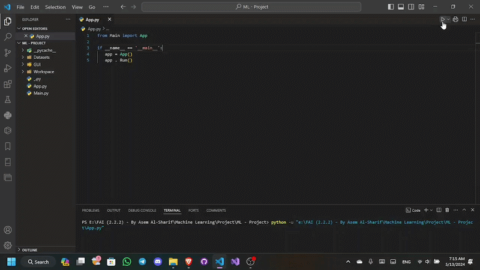
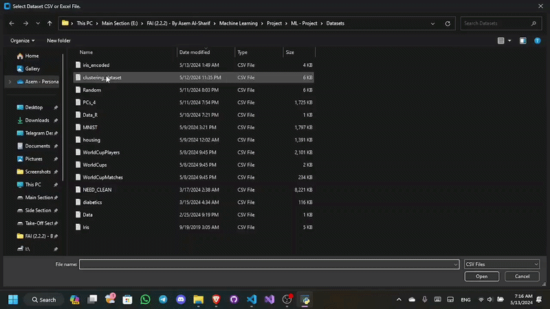
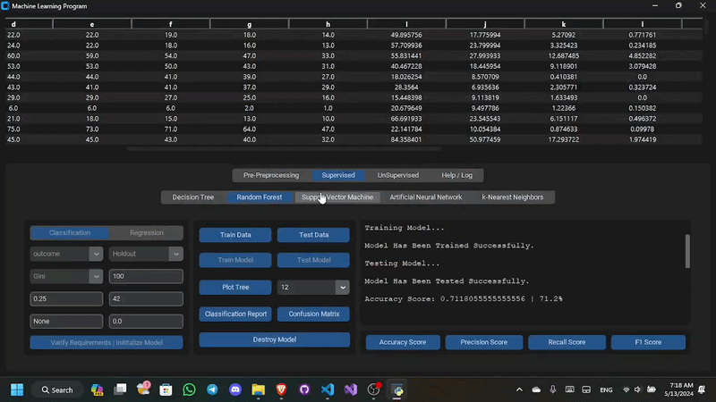

# Machine Learning Workspace

> A no-code desktop application for the full machine learning pipeline - load any dataset, preprocess it visually, train and evaluate 6 algorithms with live parameter tuning, and explore results through rich visualizations. No code required.

---

## Demo

| Preprocessing | Unsupervised Clustering |
|---|---|
|  |  |

| Supervised |
|---|---|
|  |  |

---

## Overview

Machine Learning Workspace was built as the capstone project of the Machine Learning course at the Faculty of Artificial Intelligence, Menoufia University - and the first real, full-scale software project in the undergraduate journey.

The idea was simple: remove the barrier between understanding ML concepts and actually running them. Every algorithm, every preprocessing step, and every evaluation metric is accessible through a clean GUI - configure parameters, hit a button, and see the results immediately. No scripts to write, no environments to manage.

The project is split into two layers that work together:

- **Workspace** - the backend engine, implementing every ML pipeline step as a clean Python class
- **GUI** - the frontend, driving the backend through a tabbed customtkinter interface

---

## How It Works
```
Import Dataset → Preprocess → Configure Model → Train → Evaluate → Visualize
```

Every step is a tab. Every parameter has an input. Every result appears in the terminal panel on the right. The dataset updates live across all tabs when preprocessing changes are applied.

---

## Preprocessing

A full data preparation pipeline - apply any combination of operations before training.

**Data Cleaning**
- Drop columns or rows by index or range
- Drop or fill NaN values - forward fill, backward fill, mean, median, mode
- Per-column imputation via statistical strategies
- Drop or replace specific values across rows or columns

**Encoding**
- Label Encoding - maps categories to integers
- One-Hot Encoding - expands a categorical column into binary columns

**Scaling**
- Standard Scaler - zero mean, unit variance
- Min-Max Scaler - scales features to [0, 1]

**Imbalance Resolution**

| Strategy | Methods |
|----------|---------|
| Oversampling | SMOTE, SMOTEN, SMOTENC, ADASYN, Random |
| Undersampling | NearMiss, Random |

**Feature Selection**
- Recursive Feature Elimination (RFE) with selectable sub-model
- Shows feature importance ranking before selection

**Dimensionality Reduction**
- PCA - select N principal components
- Shows explained variance and cumulative variance per component

**Data Split**
- Holdout - configurable test size and random state
- K-Fold - configurable number of folds

Every operation is logged with undo/redo support. The dataset view updates in real time after each step.

---

## Supervised Learning

Five algorithms, each available as a **Classifier** or **Regressor** - switchable from the same tab.

### Decision Tree
Configure splitter, criterion, max depth, and minimum impurity decrease. Visualize the full tree structure after training. Regression results shown as scatter vs predicted line with per-sample error bars.

### Random Forest
Same as Decision Tree with an added estimator count. Any individual tree in the ensemble can be inspected by index.

### Support Vector Machine
Configure kernel (`Linear`, `RBF`, `Poly`, `Sigmoid`), regularization C, tolerance, and max iterations. Decision boundary rendered as a 2D contour fill and a 3D surface over any two selected features.

### Artificial Neural Network (MLP)
Configure hidden layer topology as a size tuple (e.g. `128, 64, 32`), activation function, solver, learning rate schedule, max iterations, and early stopping patience.

### K-Nearest Neighbors
Configure K, search algorithm, distance weight, and Minkowski parameter p. Decision boundary plotted as a 2D contour and a 3D class projection over any two selected features.

---

### Classification Metrics

| Metric | Description |
|--------|-------------|
| Accuracy | Correct predictions / total |
| Precision | Positive predictive value (weighted) |
| Recall | True positive rate (weighted) |
| F1 Score | Harmonic mean of precision and recall |
| Confusion Matrix | Heatmap of true vs predicted labels |
| Classification Report | Full per-class breakdown |

### Regression Metrics

| Metric | Description |
|--------|-------------|
| MAE | Mean absolute error |
| MAPE | Mean absolute percentage error |
| MSE | Mean squared error |
| RMSE | Root mean squared error |
| R² | Proportion of variance explained |
| Explained Variance | Overall variance captured by the model |

---

## Unsupervised Learning

### K-Means Clustering
Configure number of clusters, algorithm (`Lloyd`, `Elkan`), initialization method (`K-Means++`, `Random`), N-init, max iterations, and tolerance.

**Clustering Metrics**

| Metric | Measures |
|--------|---------|
| Inertia | Sum of squared distances to nearest centroid |
| Silhouette Score | Cluster cohesion vs separation |
| Davies-Bouldin Score | Intra vs inter-cluster distance ratio |
| Calinski-Harabasz Score | Between vs within-cluster dispersion |

**K-Elbow Method** - runs GridSearchCV across k=2 to 20 and plots the elbow curve to find the optimal cluster count.

**Cluster Visualization** - 2D and 3D scatter plots with centroids, selectable feature axes.

**Assign Clusters** - writes the cluster labels back into the dataset as a new column, making them available for further preprocessing or supervised training.

---

## Parameter Customization

Every model exposes its full parameter set through the GUI - change them, reinitialize, retrain, and compare results side by side. The workflow is designed for experimentation:

1. Configure parameters in the left panel
2. Click **Verify & Initialize** - invalid inputs are caught and reported
3. Click **Train** - model fits in a background thread, UI stays responsive
4. Click any metric button to read the result in the terminal
5. Click any plot button to open the visualization
6. **Destroy Model** to reset the tab and try a new configuration

---

## Session Management

| Action | Effect |
|--------|--------|
| Undo / Redo | Step back or forward through preprocessing history |
| Export Dataset | Save the current processed state as CSV |
| Reset Session | Revert to the original imported dataset |
| Restart Session | Clear everything and start from scratch |

---

## Installation
```bash
pip install customtkinter pandas numpy matplotlib seaborn scikit-learn imbalanced-learn yellowbrick
```

## Run
```bash
python App.py
```

---

## Project Structure
```
Machine Learning Workspace/
│
├── App.py
├── Main.py
│
├── Workspace/
│   ├── PreProcessing/
│   │   └── PreProcessing.py          # Full data preparation pipeline
│   ├── Supervised/
│   │   ├── DecisionTree.py
│   │   ├── RandomForest.py
│   │   ├── SupportVectorMachine.py
│   │   ├── NeuralNetwork.py
│   │   └── KNearestNeighbors.py
│   └── UnSupervised/
│       └── KMeans.py
│
├── GUI/
│   ├── Data.py                       # Constants and configuration
│   ├── Functions.py                  # Utility functions
│   ├── Window.py                     # Main window layout
│   └── Tabs/
│       ├── PreProcessing/
│       │   └── PreProcessing_Tab.py
│       ├── Supervised/
│       │   ├── Supervised_Tab.py
│       │   └── Models/
│       │       ├── DecisionTree_Tab.py
│       │       ├── RandomForest_Tab.py
│       │       ├── SupportVectorMachine_Tab.py
│       │       ├── NeuralNetwork_Tab.py
│       │       └── KNearestNeighbors_Tab.py
│       ├── UnSupervised/
│       │   ├── UnSupervised_Tab.py
│       │   └── Models/
│       │       └── KMeans_Tab.py
│       └── Additional/
│           └── Log_Tab.py
│
└── Demo/
    ├── demo-1.gif
    ├── demo-2.gif
    ├── demo-3.gif
    └── demo-4.gif
```

---

## Course

**Machine Learning**
Faculty of Artificial Intelligence, Menoufia University - Year 2
