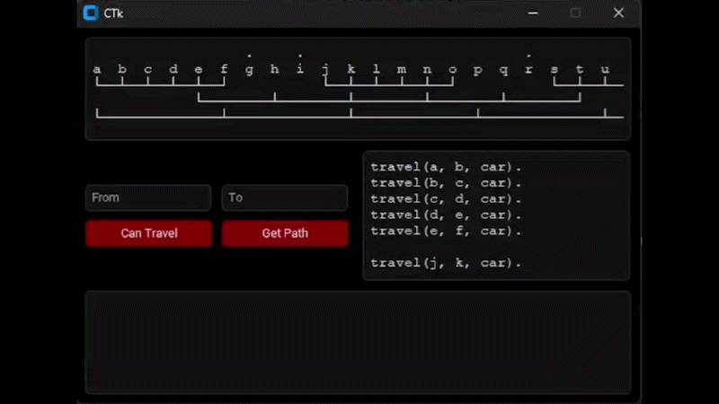

# Planning a Travel Journey - Prolog & Python GUI

> A logic-based travel planner built in Prolog and wrapped in a customtkinter GUI - queries a knowledge base of transportation routes to determine reachability, travel means, and multi-hop paths between places.

---

## Demo



---

## Task

```
Title - [Planning a Travel Journey]

Develop a Prolog program that helps in planning a travel journey from one place to another.

The travel journey can take place either by:
  - `car`
  - `train`
  - `plane`
  -  Chaining together any two or three of the previously mentioned transportation means.

The developed program is used to:
  - Determine the transportation means required to travel from one place to another.
  - Determine the intermediate places which are needed to pass through when getting from one place to another.
  - Decide the conditions which make the input operations are complaint with the program database.

Suggest ten places that can be used in the different travel journeys, then:
  - Use the suggested places to ask ten different queries to test the validity of the program.
      - Five of the suggested queries should result in valid travel journeys.
      - The other five should result in invalid travel journeys.
  - Describe in detail why each of the ten queries can either be valid or invalid.
```
---

## Overview

This project was built as the practical component of the Logic Programming course at the Faculty of Artificial Intelligence, Menoufia University. The core logic is written entirely in Prolog - a declarative language where the program defines facts and rules, and the engine derives answers through unification and backtracking.

The Python GUI connects to the Prolog engine via `pyswip`, allowing interactive querying of the knowledge base without writing Prolog syntax manually.

---

## Map
```
                  .     .                          .                    .      -> Unreachable
a  b  c  d  e  f  g  h  i  j  k  l  m  n  o  p  q  r  s  t  u  v  w  x  y  z
└──┴──┴──┴──┴──┘           └──┴──┴──┴──┴──┘           └──┴──┴──┴──┴──┘         -> Car
            └────────┴────────┴────────┴────────┴────────┘                     -> Train
└──────────────┴──────────────┴──────────────┴──────────────┴──────────────┘   -> Plane
```

The knowledge base covers 26 nodes (a–z) connected by three transport layers. Some nodes are intentionally unreachable - they exist in the alphabet but have no defined routes.

---

## Knowledge Base - `Project.pl`

### Facts

Direct connections between places, defined as `travel(From, To, By)`:

**Car routes** - three isolated segments:
```prolog
travel(a, b, car).  travel(b, c, car).  travel(c, d, car).  travel(d, e, car).  travel(e, f, car).
travel(j, k, car).  travel(k, l, car).  travel(l, m, car).  travel(m, n, car).  travel(n, o, car).
travel(s, t, car).  travel(t, u, car).  travel(u, v, car).  travel(v, w, car).  travel(w, x, car).
```

**Train routes** - connects the three car segments via key junction nodes:
```prolog
travel(e, h, train).  travel(h, k, train).  travel(k, n, train).
travel(n, q, train).  travel(q, t, train).
```

**Plane routes** - long-range connections spanning the full map:
```prolog
travel(a, f, plane).  travel(f, k, plane).  travel(k, p, plane).
travel(p, u, plane).  travel(u, z, plane).
```

---

### Rules

**Reachability without specifying transport:**
```prolog
travel(FROM, TO) :- travel(FROM, TO, _).
travel(FROM, TO) :- travel(FROM, STOP, _), travel(STOP, TO).
```

The second rule enables **chaining** - if you can reach a stop from the origin, and the destination from that stop, the full journey is reachable regardless of transport means. This is recursive and relies on Prolog's backtracking to explore all possible intermediate nodes.

**Path enumeration:**
```prolog
path(FROM, TO, [travel(FROM, TO, BY)]) :- travel(FROM, TO, BY).
path(FROM, TO, [travel(FROM, STOP, BY) | REST]) :- travel(FROM, STOP, BY), path(STOP, TO, REST).
```

Returns all valid paths as a list of steps. The base case matches a direct connection. The recursive case builds the path list by prepending each hop and continuing from the stop - Prolog's backtracking explores every possible route combination automatically.

---

## Queries & Results

### Valid Journeys

| # | Query | Why Valid |
|---|-------|-----------|
| 1 | `a → e` | Direct car route: a→b→c→d→e |
| 2 | `a → k` | Car to e, train to h, train to k |
| 3 | `a → z` | Plane: a→f→k→p→u→z |
| 4 | `j → t` | Car to n, train to q, train to t |
| 5 | `e → u` | Train to k, plane to p, plane to u |

### Invalid Journeys

| # | Query | Why Invalid |
|---|-------|-------------|
| 6 | `a → g` | g has no incoming or outgoing routes |
| 7 | `z → a` | All routes are one-directional, no reverse travel defined |
| 8 | `b → z` | b is in the first car segment - no connection to plane nodes |
| 9 | `s → a` | s segment is isolated from a segment with no bridging route |
| 10 | `x → z` | x is the end of the third car segment - no onward route to z |

---

## Features

- **Can Travel** - checks if a journey between two places is possible, optionally filtered by transport means
- **Get Path** - returns all valid paths with every intermediate stop and transport used
- **Execute Query** - runs any raw Prolog query directly against the database
- **Show Database** - displays the full `Project.pl` knowledge base in a popup window

---

## Installation

**Requirements**
- Python 3.8+
- SWI-Prolog (must be installed and in PATH)
- customtkinter
- pyswip
```bash
pip install customtkinter pyswip
```

SWI-Prolog: https://www.swi-prolog.org/Download.html

---

## Run
```bash
python Project.py
```

---

## Project Structure
```
Planning a Travel Journey/
├── Project.py      # Python GUI and Prolog bridge
├── Project.pl      # Prolog knowledge base (facts + rules)
├── README.md       # Project documentation
└── demo.gif        # Application demo
```

---

## Course

**Logic Programming**
Faculty of Artificial Intelligence, Menoufia University - Year 2