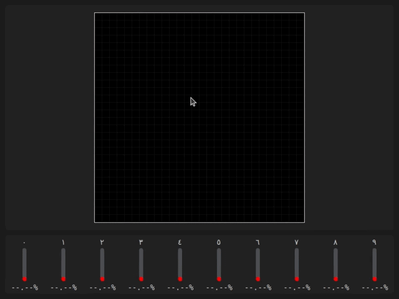
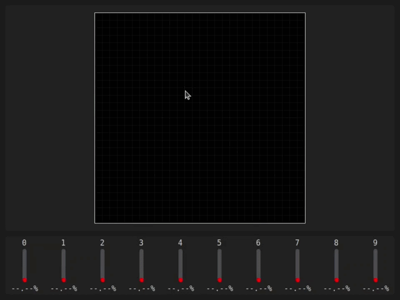

# Real-Time Digit Classifier - MNIST

> A live handwriting digit classifier built in 20 minutes to demonstrate AI, learning, and model confidence to younger students - draw a digit, watch the model think in real time.

---

## Demo

| Arabic | English |
|---|---|
|  |  |

---

## Overview

Draw any digit (0–9) on the canvas and the model instantly predicts it - showing confidence bars for all 10 possible digits simultaneously. Supports both English and Arabic digit display modes, switchable mid-session.

Built during a social outreach activity to give non-technical students a tangible, visual feel for what AI actually does - not theory, just draw and watch.

---

## How to Use

| Input | Action |
|-------|--------|
| **Left click / drag** | Draw on the canvas |
| **Right click** | Clear the canvas |
| **Scroll wheel** | Adjust brightness of individual pixels |
| **Middle click** | Switch between AR / EN mode |

The model runs automatically after a brief pause in drawing - no button needed.

---

## Models

Two CNN models trained on MNIST, one per language mode:

| Mode | Model File | Digit Labels |
|------|------------|--------------|
| EN | `Models/EN.keras` | 0 1 2 3 4 5 6 7 8 9 |
| AR | `Models/AR.keras` | ٠ ١ ٢ ٣ ٤ ٥ ٦ ٧ ٨ ٩ |

Switch modes at any time with **middle click**.

---

## Download
[Dataset & Models - Google Drive](https://drive.google.com/drive/folders/1NHqzG9f--l8rzUy-RRaWvE4E2ZPkcKFW?usp=sharing)

---

## Installation
```bash
pip install numpy customtkinter tensorflow
```

## Run
```python
App.Run(lang='EN')  # or 'AR'
```

---

## Project Structure
```
Real-Time Digit Classifier/
├── App.py           # Entry point
├── Main.py          # Main layout
├── Canvas.py        # Drawing canvas with soft-brush and inactivity trigger
├── Models/
│   ├── EN.keras     # English MNIST model
│   └── AR.keras     # Arabic MNIST model
├── README.md
└── demo.gif
```

---

## Context

Built in Year 2 during a student outreach activity at the Faculty of Artificial Intelligence, Menoufia University - the goal was to show younger students what a trained model actually feels like from the inside: draw something, and watch the machine's confidence shift in real time across every possible answer.