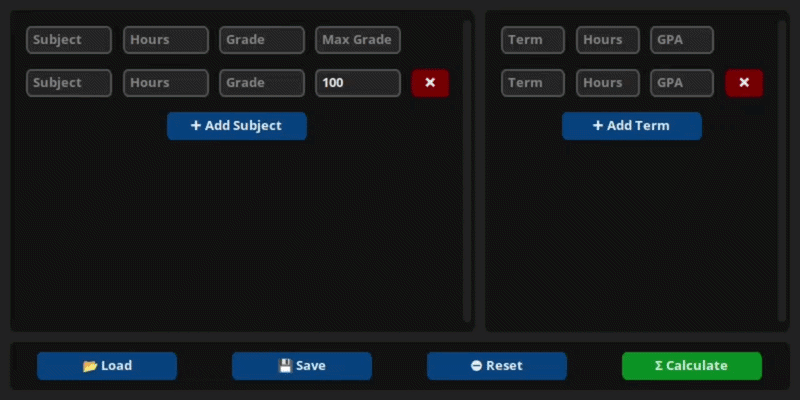

# MUFAI GPA Calculator

> A dark-themed desktop GPA calculator for students at the Faculty of Artificial Intelligence, Menoufia University. Enter subjects and prior terms, calculate your cumulative GPA, and plan exactly what you need to hit your target.

---

## Demo



---

## Overview

MUFAI GPA Calculator was built as a utility tool for AI students who want a fast, local, no-fuss way to track their academic standing. The idea is straightforward: enter your current semester subjects with their credit hours and grades, add any prior term GPAs you want to factor in, and get your cumulative result - along with the grade you need in upcoming hours to reach a desired GPA.

The project is split into two layers:

- **Calculator** - the backend engine, implementing all GPA formulas as a clean static class
- **Widgets** - the frontend, a customtkinter interface with live validation, animated bars, and JSON persistence

---

## How It Works

```
Add Subjects → Add Prior Terms → Calculate → Read Results → Plan Desired GPA
```

Subjects and terms live in scrollable panels side by side. Every entry validates in real time - borders turn green on valid input and red on invalid. The output view animates progress bars per subject and per term, then shows the overall cumulative GPA with a color-coded letter grade.

---

## Subjects Panel

Enter any number of subjects before calculating.

| Field | Description |
|-------|-------------|
| Subject | Name label for the subject |
| Hours | Credit hours (1 – 99) |
| Grade | Score achieved |
| Max Grade | Maximum possible score (default 100) |

Subjects with `Grade > Max Grade` are flagged invalid. Empty subject names are auto-filled as `Subject N`.

---

## Terms Panel

Factor in previous semester results without re-entering every subject.

| Field | Description |
|-------|-------------|
| Term | Label for the term (e.g. `Year 1 - Sem 2`) |
| Hours | Total credit hours of that term |
| GPA | GPA on a 4.0 scale |

Any combination works - subjects only, terms only, or both together.

---

## Output View

After calculating, the interface switches to a results screen.

**Bar Chart** - a horizontal scrollable row of animated vertical bars, one per subject and one per term, each color-coded from red through yellow to green.

**Overall GPA** - cumulative GPA across all subjects and terms, displayed as `X.XX / 4.00`, percentage, and letter grade, with an animated progress bar.

**Desired GPA Planner** - enter a target GPA and the number of upcoming credit hours. The calculator returns the exact GPA you need to achieve in those hours, or reports `Unachievable` if the target is out of reach.

---

## GPA Calculation

**From subjects** - each subject is weighted by its credit hours on a 4.0 scale:

```
GPA = Σ( (grade / max_grade) × 4.0 × hours ) / Σ(hours)
```

**Combining with prior terms** - weighted average across all inputs:

```
Cumulative GPA = Σ( term_GPA × term_hours ) / Σ(term_hours)
```

**Desired GPA planner:**

```
Required = ( desired × (spent + within) − current × spent ) / within
```

---

## Grade Classification

| Range | Letter |
|-------|--------|
| 95 – 100% | A+ |
| 90 – 94% | A |
| 85 – 89% | A- |
| 80 – 84% | B+ |
| 75 – 79% | B |
| 70 – 74% | B- |
| 65 – 69% | C+ |
| 60 – 64% | C |
| 55 – 59% | D+ |
| 52.5 – 54% | D |
| 50 – 52% | D- |
| < 50% | F |

---

## Session Management

| Action | Effect |
|--------|--------|
| 📂 Load | Open a previously saved `.json` data file |
| 💾 Save | Export current subjects and terms to `.json` |
| ⛔ Reset | Clear all entries and start with one empty row each |
| ⬅ Back | Return from the results view to the input panels |

---

## Data Format

```json
{
    "Subjects": [
        { "Subject": "Computer Vision", "Hours": 3, "Grade": 95.0, "Max Grade": 100 }
    ],
    "Terms": [
        { "Term": "Year 1 - Sem 1", "Hours": 18, "GPA": 3.1 }
    ]
}
```

---

## Installation

```bash
pip install customtkinter
```

## Run

```bash
python main.py
```

---

## Project Structure

```
MUFAI-GPA-Calculator/
│
├── App.py             # Entry point
├── Main.py            # Main window, subject/term management, save/load/calculate
├── Widgets.py             # Styles, constants, LockableEntry, OutputFrame
├── Calculator.py      # GPA class, classify(), colorize() - pure logic, no UI
└── demo.gif
```

---

## Course

Faculty of Artificial Intelligence, Menoufia University - Year 3